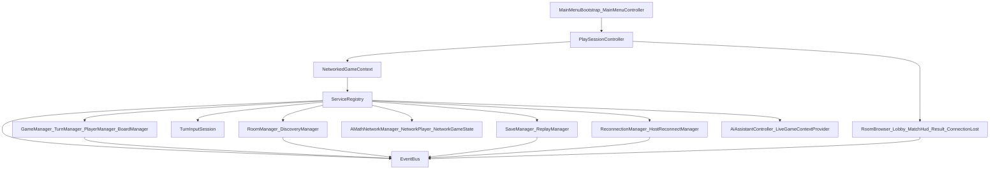
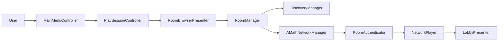
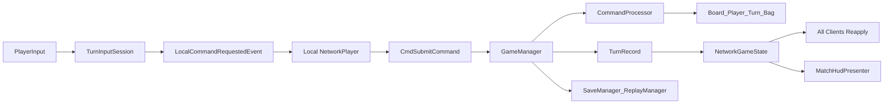
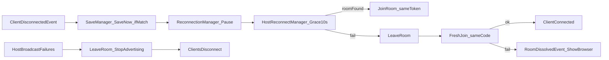

# A-Math Architecture And Data Flow

เอกสารนี้สรุปโครงสร้างสถาปัตยกรรมและการไหลของข้อมูลของโปรเจกต์ `A-Math` จากโค้ดจริงในโปรเจกต์ โดยเน้นระบบ runtime ของเกม, networking, save/replay/recovery, tutorial และ AI assistant

## ภาพรวมสถาปัตยกรรม

โปรเจกต์นี้ใช้แนวทาง `service-driven runtime` เป็นหลัก โดยมี `NetworkedGameContext` เป็น composition root กลางของโหมดเล่นปกติ ทำหน้าที่สร้าง service ต่าง ๆ, ผูก dependency, และขับ `ITickable` ทุกตัวจาก `Update()` เดียว ส่วน UI หลักถูกสร้างด้วยโค้ดและทำงานเป็น presenter/controller มากกว่าจะเป็นเจ้าของ game state เอง

## Subsystem หลัก

### 1. Main Menu และ Scene Bootstrap

ไฟล์หลัก:
- `Assets/Script/MainMenu/MainMenuBootstrap.cs`
- `Assets/Script/MainMenu/MainMenuController.cs`
- `ProjectSettings/EditorBuildSettings.asset`

หน้าที่:
- เริ่มจาก `SampleScene` ซึ่งเป็น scene แรกใน build settings
- สร้าง main menu แบบ runtime
- เปิด `PlaySessionController` เมื่อผู้เล่นกดเริ่มเกม
- เปิด `TutorialScene` เมื่อผู้เล่นเข้าโหมดฝึก

สิ่งสำคัญ:
- play flow หลักไม่ได้สลับไป gameplay scene อื่น แต่คงอยู่ใน `SampleScene` แล้วสลับสถานะผ่าน controller/presenter
- tutorial ใช้ scene แยกชื่อ `TutorialScene`

### 2. Composition Root และ Service Wiring

ไฟล์หลัก:
- `Assets/Scripts/Bootstrap/NetworkedGameContext.cs`
- `Assets/Scripts/Core/ServiceRegistry.cs`
- `Assets/Scripts/Core/Events/EventBus.cs`
- `Assets/Scripts/Bootstrap/NetworkSessionFactory.cs`

หน้าที่:
- เป็นศูนย์กลางการประกอบระบบ runtime ของโหมดเล่น
- ลงทะเบียน service ทั้ง gameplay, networking, save/replay, reconnect และ AI
- สร้าง Mirror stack แบบ runtime เมื่อ scene ไม่มี object ที่ wire ไว้ล่วงหน้า
- ติดตั้ง service registry ลงใน `NetworkContext`

สิ่งสำคัญ:
- manager ส่วนใหญ่เป็น plain C# class ไม่ใช่ `MonoBehaviour`
- `EventBus` เป็นกลไก coupling หลักระหว่าง subsystem
- `ServiceRegistry` เป็น DI container ขนาดเล็กแบบ explicit ไม่มี reflection

### 3. Gameplay Domain

ไฟล์หลัก:
- `Assets/Scripts/Managers/GameManager.cs`
- `Assets/Scripts/Managers/TurnManager.cs`
- `Assets/Scripts/Gameplay/CommandProcessor.cs`
- `Assets/Scripts/Gameplay/Board/BoardManager.cs`
- `Assets/Scripts/Gameplay/Players/PlayerManager.cs`
- `Assets/Scripts/Gameplay/Board/TileBag.cs`

หน้าที่:
- `GameManager` orchestrate วงจรแมตช์
- `TurnManager` ดูแล turn order, timer, pass counter
- `CommandProcessor` validate และ execute command จริง
- `BoardManager` และคลาสในโฟลเดอร์ board ดูแลกติกา placement/scoring
- `PlayerManager` เก็บ roster, rack, score, connection flag

สิ่งสำคัญ:
- `GameManager` intentionally thin: ไม่แบกกติกาทั้งหมดเอง
- deterministic logic ทั้ง host, client และ replay ใช้ command pipeline ชุดเดียวกัน
- state สำคัญถูก snapshot ได้เพื่อ save/reconnect

### 4. Input Draft และ Match HUD

ไฟล์หลัก:
- `Assets/Scripts/Gameplay/Interaction/TurnInputSession.cs`
- `Assets/Scripts/UI/Presenters/MatchHudPresenter.cs`
- `Assets/Script/Play/PlaySessionController.cs`

หน้าที่:
- `TurnInputSession` เป็น local draft ของผู้เล่น: เลือก tile, วางชั่วคราว, preview score, คอนเฟิร์มเป็น command
- `MatchHudPresenter` แปลง domain state/network state ให้ UI อ่านง่าย
- `PlaySessionController` สร้างหน้าจอ Browser, Lobby, Match, Result และ overlay ต่าง ๆ

สิ่งสำคัญ:
- UI ไม่ mutate authoritative game state โดยตรง
- draft ถูกเก็บ local ก่อน แล้วแปลงเป็น `LocalCommandRequestedEvent`
- ระบบนี้แยก “presentation state” ออกจาก “match state” ค่อนข้างชัด

### 5. Room, Discovery และ Authentication

ไฟล์หลัก:
- `Assets/Scripts/Networking/Room/RoomManager.cs`
- `Assets/Scripts/Networking/Room/RoomSession.cs`
- `Assets/Scripts/Networking/Discovery/DiscoveryManager.cs`
- `Assets/Scripts/Networking/Messages/RoomAuthenticator.cs`
- `Assets/Scripts/Networking/Messages/AuthMessages.cs`

หน้าที่:
- `RoomManager` ดูแล lifecycle ของ room ทั้ง host และ client
- `RoomSession` เป็น single source of truth ของข้อมูลห้องบนเครื่องนั้น
- `DiscoveryManager` ทำ LAN discovery และเก็บ registry ของห้องที่มองเห็น
- `RoomAuthenticator` เป็น gatekeeper ของ connection ก่อน spawn player

สิ่งสำคัญ:
- room code ใช้เพื่อ lookup ห้องบน LAN ไม่ได้ใช้แทน network address ตรง ๆ
- host-authentication ตรวจ version, room code, persistent GUID, reconnect token
- match ที่กำลังเล่นอยู่รับเฉพาะ reconnection ของ seat เดิม

#### Troubleshooting: ค้นหาห้องไม่เจอ

ระบบ discovery ใช้ **UDP broadcast พอร์ต 47777** บน LAN เท่านั้น (ไม่รองรับ join ข้ามอินเทอร์เน็ต)

| อาการ | สิ่งที่ควรตรวจ |
|--------|----------------|
| รายการห้องว่างตลอด | ทั้ง host และ client อยู่ LAN/Wi‑Fi เดียวกัน, ไม่ใช่ guest network ที่แยก client |
| ใส่รหัสแล้วไม่เจอ | client ต้องเปิดหน้า Join อยู่และรอรับ broadcast จาก host ก่อน (รหัสเป็น lookup key ไม่ใช่ server กลาง) |
| `[Discovery] Cannot start listening` | พอร์ต 47777 ถูกใช้งานอยู่ — ปิดเกมที่ค้าง หรือ restart |
| Host log ไม่มี `[Room] Hosting ... code XXXXXX` | ฝั่ง host ยังไม่ได้สร้างห้องสำเร็จ |

พอร์ตที่เกี่ยวข้อง:
- **47777** — LAN discovery (client ต้องรับ inbound ได้)
- **7778** — KCP game (host ต้องรับ inbound เมื่อมีคน join)

Windows:
- ตัวติดตั้งและเกมจะไม่เพิ่มกฎ Firewall เอง (การเรียก netsh จากไฟล์ที่ยังไม่เซ็นชื่อมักถูก Defender บล็อก)
- ถ้ายังไม่เจอห้อง ให้ตรวจว่า profile เป็น Private/Domain แล้วอนุญาต `A-Math.exe` ใน Windows Firewall และปิด **AP isolation** บน router ถ้าเปิดอยู่

Log ที่มีประโยชน์:
- Host: `[Room] Hosting '...' code XXXXXX on port 7778`
- Host: `[Discovery] Broadcast failed` — ปัญหา network interface
- Client: `[Discovery] Cannot start listening` — bind พอร์ต 47777 ไม่ได้

### 6. Mirror Networking และ Replication

ไฟล์หลัก:
- `Assets/Scripts/Networking/AMathNetworkManager.cs`
- `Assets/Scripts/Networking/RPC/NetworkPlayer.cs`
- `Assets/Scripts/Networking/RPC/NetworkGameState.cs`

หน้าที่:
- `AMathNetworkManager` แปลง callback ของ Mirror เป็น domain event และ establish host authority
- `NetworkPlayer` เป็นช่อง client -> host สำหรับ command gameplay
- `NetworkGameState` เป็น replication hub ของ match state

สิ่งสำคัญ:
- ระบบนี้เป็น `host-authoritative`
- board ไม่ถูก stream ทั้งกระดานทุกเฟรม
- host broadcast แค่ `TurnRecord` และ scalar state สำคัญ แล้วทุก client replay deterministic logic เอง
- full snapshot ถูกส่งเฉพาะกรณี reconnect, late join หรือ desync recovery

## Data Flow หลัก

### 1. Start / Join Room Flow

คำอธิบาย:
1. ผู้เล่นเริ่มจาก main menu แล้วเข้า `PlaySessionController`
2. ถ้าสร้างห้อง `RoomManager.CreateRoom()` จะ:
   - เติมข้อมูลใน `RoomSession`
   - configure transport
   - start host
   - start advertising ผ่าน `DiscoveryManager`
3. ถ้าค้นหาห้อง `DiscoveryManager` จะฟัง broadcast บน LAN แล้วอัปเดตรายการห้อง
4. ตอน join client จะส่ง `AuthRequestMessage` ไปยัง host ก่อนมีการ spawn object ใด ๆ
5. host ตรวจสิทธิ์ใน `RoomAuthenticator`
6. ถ้าผ่าน host จะ spawn `NetworkPlayer` และ lobby UI อ่าน roster จาก object ที่ replicate มาแล้ว

### 2. Gameplay Turn Flow

คำอธิบาย:
1. ผู้เล่นเลือก tile และวาง draft ผ่าน `TurnInputSession`
2. เมื่อคอนเฟิร์ม draft จะถูกแปลงเป็น command แล้ว publish เป็น `LocalCommandRequestedEvent`
3. `NetworkPlayer` ของ local player รับ event แล้วส่ง `CmdSubmitCommand` ไปหา host
4. host ไม่เชื่อ payload เรื่อง identity แต่ใช้ seat ของ connection เป็นผู้ระบุ `PlayerId`
5. `GameManager.SubmitCommand()` เรียก `CommandProcessor` เพื่อตรวจและ execute
6. ถ้าผ่าน host จะสร้าง `TurnRecord`
7. `NetworkGameState.RpcApplyTurn()` ส่ง record ไปยัง client ทุกเครื่อง
8. client ทุกเครื่อง re-apply record เดิมผ่าน deterministic pipeline ชุดเดียวกัน
9. `SaveManager` และ `ReplayManager` เกาะ `TurnResolvedEvent` เพื่อ autosave และเก็บ replay log

### 3. Disconnect / Reconnect Flow

คำอธิบาย:
1. ถ้า client หลุดจาก host (ทั้ง lobby และ mid-match) `ReconnectionManager` เริ่ม grace ~5 วินาที
2. mid-match จะ backup save และ pause ก่อน
3. `HostReconnectManager` ค้นหา room code เดิมแล้วลอง seat-token reconnect — **ไม่มีการ promote เป็น host ใหม่**
4. ถ้า reconnect ไม่สำเร็จ จะ `LeaveRoom` แล้วพยายาม fresh join รหัสเดิมถ้า host ยังโฆษณาห้องอยู่
5. ถ้า fresh join ไม่ได้ จะ publish `RoomDissolvedEvent` แล้ว UI กลับไปหน้า browser
6. ถ้า host หลุดเน็ต (broadcast ล้มเหลวติดกัน) จะยุบทั้งห้องรอเล่นและห้องเล่นผ่าน `LeaveRoom` / หยุดโฆษณา

## Data Objects สำคัญ

### `RoomSession`
เก็บสถานะห้องของเครื่องปัจจุบัน:
- `RoomName`
- `RoomCode`
- `MaxPlayers`
- `Port`
- `IsHost`
- `IsActive`
- `ReconnectToken`
- `SelectedFormat`

ใช้ร่วมกันโดย room layer, authenticator, discovery broadcaster และ UI

### `MatchConfig`
สัญญาเริ่มแมตช์ที่ต้องเหมือนกันทุกเครื่อง:
- random seed
- รายชื่อผู้เล่นตามลำดับ turn
- turn seconds
- game version
- match format

host สร้างครั้งเดียวแล้ว broadcast ไปทุก client

### `TurnRecord`
ตัวแทนของหนึ่งเทิร์นที่ host ยอมรับ:
- turn number
- player id
- command type/payload
- score delta
- timestamp
- end-of-match markers

เป็นแกนของ replication strategy เพราะ client ใช้มัน replay logic เดิมซ้ำ

### `GameStateSnapshot`
ภาพเต็มของ match state ณ เวลาหนึ่ง:
- `MatchConfig`
- phase
- RNG state
- current turn
- bag contents
- occupied board cells
- players พร้อม rack/score
- result

ใช้ทั้งใน save file และ reconnect/resync

### `ReplayLog`
log ของ accepted turns ทั้งหมดในแมตช์:
- เก็บแยกจาก transport
- สร้างจาก `TurnResolvedEvent`
- ใช้สำหรับ replay, restore และประกอบ full-state transfer

## Tutorial และ AI Assistant

### Tutorial Flow

ไฟล์หลัก:
- `Assets/Script/Tutorial/TutorialSceneController.cs`
- `Assets/Scripts/Tutorial/TutorialManager.cs`
- `Assets/Scripts/Tutorial/Bootstrap/TutorialRuntimeContext.cs`

ลักษณะ:
- ใช้ service registry ของตัวเองใน `TutorialScene`
- bootstrap ด้วย `TutorialSceneBootstrap`
- tutorial manager ควบคุม step, hint, objective, save progress
- ไม่ได้เป็นเจ้าของ gameplay จริง แต่สังเกต/นำเสนอ state เพื่อการสอน

### AI Assistant Flow

ไฟล์หลัก:
- `Assets/Scripts/AI/Chat/AiAssistantController.cs`
- `Assets/Scripts/AI/Context/LiveGameContextProvider.cs`
- `Assets/Scripts/AI/Chat/OpenAiCompatibleClient.cs`

ลักษณะ:
- optional subsystem
- `LiveGameContextProvider` สร้าง safe context จากเกมจริง
- `AiAssistantController` เลือก mode, เรียก backend หรือ scripted mode และส่งผลให้ view
- chat เป็น advisory only ไม่ได้ mutate gameplay โดยตรง

## สรุปเชิงสถาปัตยกรรม

ประเด็นสำคัญที่สุดของโปรเจกต์นี้คือ:

1. `NetworkedGameContext` เป็น composition root กลางของ play mode
2. `EventBus` เป็นเส้นประสาทหลักของการสื่อสารระหว่าง subsystem
3. gameplay ใช้ deterministic command pipeline ชุดเดียวกันใน host, client และ replay
4. networking เป็น `host-authoritative` อย่างชัดเจน
5. replication strategy เน้น `TurnRecord` มากกว่าการ stream board state ทั้งก้อน
6. save/replay/recovery ถูกออกแบบให้แยกออกจาก transport แต่เชื่อมกับ event flow เดียวกัน
7. tutorial และ AI เป็น subsystem เสริมที่ต่อเข้าระบบผ่าน interface/read-only context มากกว่าการผูกตรงกับ game core

## ไฟล์ที่ควรอ่านต่อ ถ้าจะลงรายละเอียด

- `Assets/Scripts/Bootstrap/NetworkedGameContext.cs`
- `Assets/Scripts/Bootstrap/NetworkSessionFactory.cs`
- `Assets/Script/Play/PlaySessionController.cs`
- `Assets/Scripts/Networking/Room/RoomManager.cs`
- `Assets/Scripts/Networking/Messages/RoomAuthenticator.cs`
- `Assets/Scripts/Networking/AMathNetworkManager.cs`
- `Assets/Scripts/Networking/RPC/NetworkPlayer.cs`
- `Assets/Scripts/Networking/RPC/NetworkGameState.cs`
- `Assets/Scripts/Managers/GameManager.cs`
- `Assets/Scripts/Gameplay/CommandProcessor.cs`
- `Assets/Scripts/Save/SaveManager.cs`
- `Assets/Scripts/Networking/HostMigration/ReconnectionManager.cs`
- `Assets/Scripts/Networking/HostMigration/HostMigrationManager.cs` (`HostReconnectManager` และ compatibility wrapper เดิม)
- `Assets/Script/Tutorial/TutorialSceneController.cs`
- `Assets/Scripts/AI/Chat/AiAssistantController.cs`
